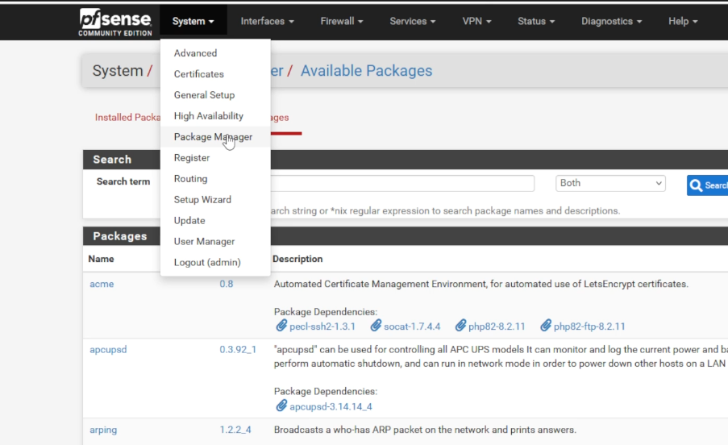
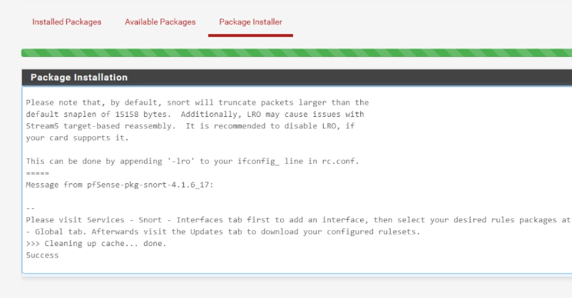
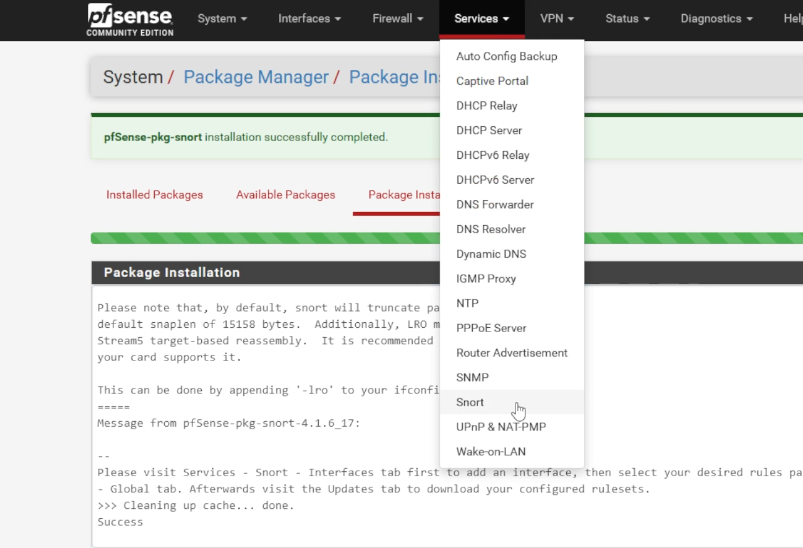
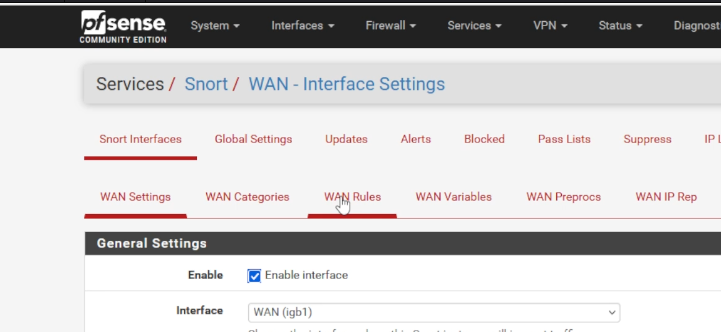
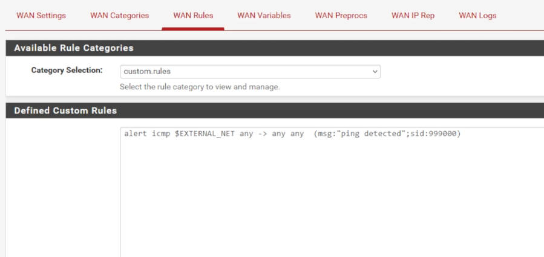
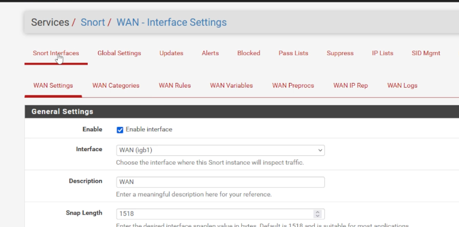
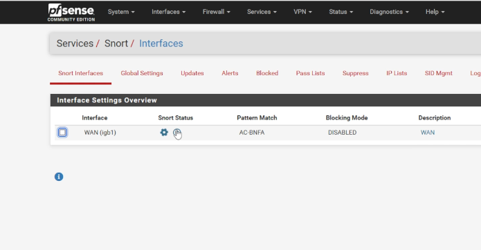
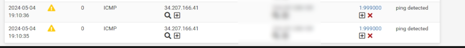

## INSTALL THE SNORT PACKAGE
+ Go to "System/Package Manager"  
+ Click on the "Available Packages" tab
+ In the search box, type "snort"
+ Click the install button
+ Click "Confirm"
+ You will see "Success" upon Snort install  

## ASSIGN AN INTERFACE TO SNORT
+ Click on "Services/Snort"  
+ Click "Add"
+ You should be in to "Services/Snort/WAN - Interface Settings" 
+ You can leave all of the settings as is and click "Save"

## CREATE THE CUSTOM DETECT PING RULE
+ Click on the "WAN Rules" tab 
+ In the "Defined Custom Rules" box, enter the following
+ **alert icmp $EXTERNAL_NET any -> any any (msg:"Ping Detected";sid 999000;) ** 
+ Click "Save"

## START THE SNORT SERVICE
+ Click on the "Snort Interfaces" tab 
+ Click on the "play" button under the "Snort Status" label  

Once you ping the public IP address of your firewall, you can click on "Services/Snort/Alerts", and see the pings showing up in the logs  
